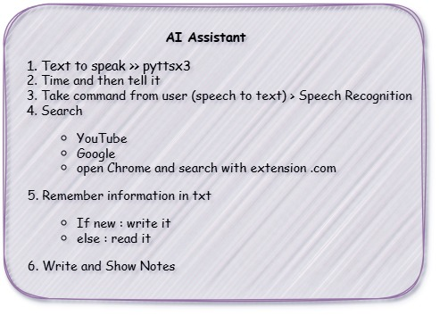

<h1 align="center">Hi 👋, it's AI Assistant in simple</h1>
<h3 align="center">
  
</h3>

- 🌱 If you want to explore and practice more on Ai Assistance. here, you can find how to implement it using basics libraries to automate your tasks like send email, search, take notes and save important informations 

- ### 🔭 I used Libs like:

      Pyttsx3:

              It's a text-to-speech conversion library in Python. It allows you to convert written text into spoken words.

      peechRecognition:

              It allows us to recognize speech from audio files or live microphones.
      SMTP:

              It is a built-in module used for sending emails using the Simple Mail Transfer Protocol (SMTP). It provides a way to connect to an SMTP server and send email messages programmatically.
      

- 🌱 If you want to take further step, I recommened to use Agents from Langchain or if you wanna no code , you can use n8n tool 
